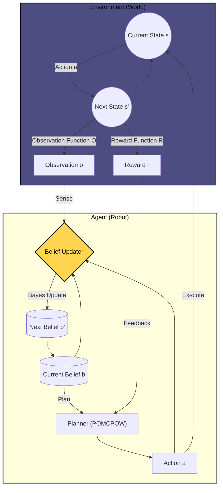
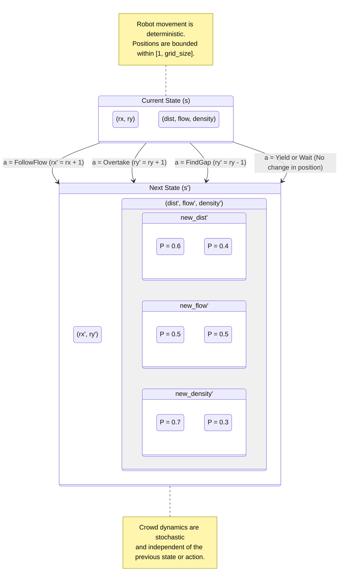

# POMDP-Based Socially Compliant Mobile Robot Navigation

This repository implements a **Partially Observable Markov Decision Process (POMDP)** model for socially compliant robot navigation in a simplified crowd environment. The project is written in **Julia** and uses the **POMDPs.jl** ecosystem with an online Monte Carlo Tree Search based planning approach.

The goal is to demonstrate how uncertainty in crowd perception and social context can be incorporated into robot navigation decision-making.

---

## Overview

The robot navigates a discrete 2D grid while interacting with a crowd characterized by:
- **Crowd distance** (far / near)
- **Crowd flow direction** (aligned / opposing)
- **Crowd density** (low / high)

These crowd properties are **partially observable** and perceived through noisy observations. At each step, the robot selects a socially relevant action and receives a reward that encourages safe and socially compliant behavior.

Planning is performed online using **POMCPOW**, a Monte Carlo Tree Search (MCTS) algorithm designed for large POMDPs.

---

## State Space

The POMDP state consists of:

- Robot position: `(rx, ry)`
- Crowd distance: `1 = far`, `2 = near`
- Crowd flow: `1 = aligned`, `2 = opposing`
- Crowd density: `1 = low`, `2 = high`

```text
CrowdState = (robot_x, robot_y, distance, flow, density)
```

#### State transition diagram is visualized as below:


#### Functional block diagram is visualized as below:



---

#### Following visualizations show the results of the 1000-step simulation run:


**Lesson learned and possible improvement:** Here the reward structure is based on social rules considering various social situations. The above results may make sense at first glance, but this still remains incomplete becuase all of the possible social rules cannot be encoded into a single rule base system. Plus, I tried reward structures utilizing a quadratic and polynomial function - but still the results were not promising. So, we need a more complicated reward structure that could capture most of  the social nuances. 

